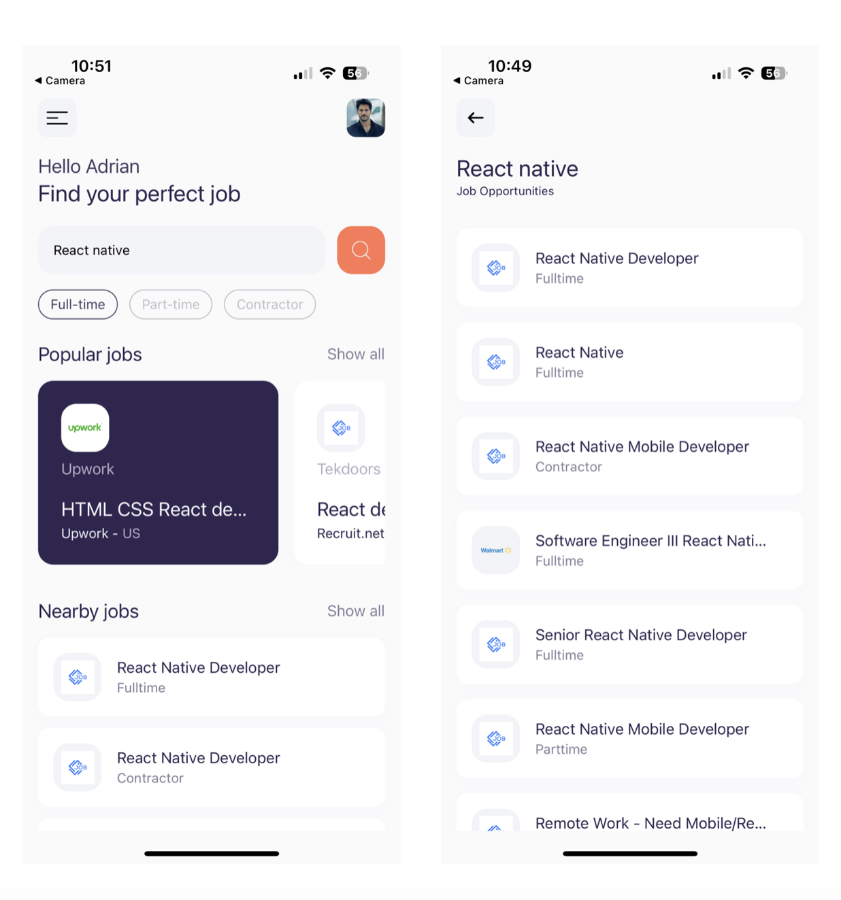

# react-native-jobs

This React Native application is a three screen application with elegant UI/UX that lets user dynamically fetch data from the JSearch RapidAPI. It allows users to browse developer jobs from the most popular platforms such LinkedIn, Indeed, Glassdoor and more.It also has
- Job details page
- Custom hooks for fetching data
- Dynamic stylesheet
- Responsive design across all devices 
- Search functionality
- Pagination
- Custom screen headers

# Requirements
- Develop visually appealing UI/UX design
- Fetch data from an external API and integrate it
- Implement Search and Pagination functionality to improve performance and UX
- Create custom hooks for fetching data from APIs 
- Use Stylesheets to dynamically apply styles to components based on user input

# Future Improvement 
- Implement share, show all and navigation bar menu features

